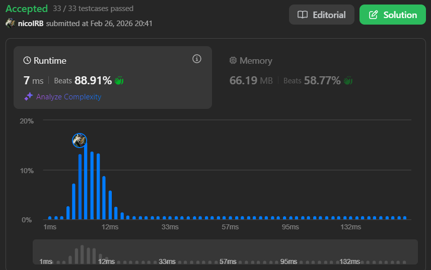

# Problema: Min Stack

Autor: **Nicolas Borges**
Revisado por:

Projete uma pilha que suporte push, pop, top e a recuperação do elemento mínimo em tempo constante.

Implemente a classe `MinStack`:

* `MinStack()` inicializa o objeto da pilha.

* `void push(int val)` adiciona o elemento `val` ao topo da pilha.

* `void pop()` remove o elemento no topo da pilha.

* `int top()` retorna o elemento no topo da pilha.

* `int getMin()` retorna o menor elemento presente na pilha.

Você deve implementar uma solução com complexidade de tempo `O(1)` para cada função.

# Exemplo:

## Primeiro:

**Entrada:**

["MinStack","push","push","push","getMin","pop","top","getMin"]
[[],[-2],[0],[-3],[],[],[],[]]

**Saída:**

[null,null,null,null,-3,null,0,-2]

**Explicação:**

MinStack minStack = new MinStack();
minStack.push(-2);
minStack.push(0);
minStack.push(-3);
minStack.getMin(); // retorna -3
minStack.pop();
minStack.top();    // retorna 0
minStack.getMin(); // retorna -2

# Restrições:
* `-2³¹ ≤ val ≤ 2³¹ - 1`

Os métodos pop, top e getMin sempre serão chamados em pilhas não vazias.

No máximo 3 × 10⁴ chamadas serão feitas aos métodos push, pop, top e getMin.

# Como o LLM foi utilizado:

Quando me faltava compreensão de como funcionava algo na línguagem TypeScript, pediria uma explicação sobre as funções e suas estruturas para fazer uso na programação de uma solução.

# Evidência

