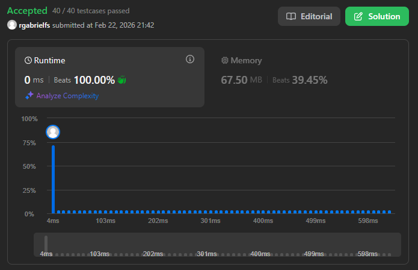

# Problema: Rotate Array

Autor: **Ricardo Fialho**.

Revisado por:

Given an integer array nums, rotate the array to the right by k steps, where k is non-negative.

# Exemplo:

## Primeiro:

**Entrada:** nums = [1,2,3,4,5,6,7], k = 3

**Saída:** [5,6,7,1,2,3,4]

**Explicação:**
rotate 1 steps to the right: [7,1,2,3,4,5,6]
rotate 2 steps to the right: [6,7,1,2,3,4,5]
rotate 3 steps to the right: [5,6,7,1,2,3,4]

## Segundo:

**Entrada:** nums = [-1,-100,3,99], k = 2

**Saída:** [3,99,-1,-100]

**Explicação:**
rotate 1 steps to the right: [99,-1,-100,3]
rotate 2 steps to the right: [3,99,-1,-100]

# Restrições

- `1 <= nums.length <= 10^5`
- `-2^31 <= nums[i] <= 2^31 - 1`
- `0 <= k <= 10^5`

# Como o LLM foi utilizado:

A princípio foi desenvolvido um código que satisfez às condições do exercício, entretanto, em seguida questionei à IA se havia um modo mais otimizado de executar a ação abordada.

# Evidência

